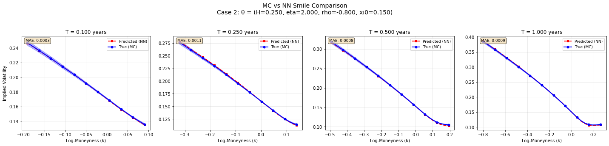

# Deep Learning Volatility
[](https://doi.org/10.5281/zenodo.17018686)


Framework for **volatility surface approximation**  with neural networks.
Experience sub-basis-point accuracy with order-of-magnitude speedup over Monte Carlo methods.
It includes dataset generators (*random grid*), neural pricers (grid, pointwise, multi‑regime),
Monte Carlo engines for rough/classical models, and post‑processing tools.

> Status: research project in progress (APIs may change).

---

## Key features

- **Neural pricers**
  - Grid‑based (dense surface on a T×K grid)
  - Pointwise (single queries (	$\theta$, T, K)) with *random grid* and time buckets
  - Multi‑regime (short/mid/long) with automatic routing
- **Data generation**: Monte Carlo with **absorption** handling for rough models (long‑term regime)
- **Supported processes** (excerpt): Rough Bergomi, Rough Heston, Lifted Heston, GBM, jump‑diffusion processes (Kou/Merton)
- **Post‑processing**: surface interpolation and smile repair modules
- **Examples**: scripts for stability analysis, MC debugging, and long‑term absorption

---

## Results: Pointwise Network Performance



**Process**: Rough Bergomi model ($H=0.25$, $\eta=2.00$, $\rho=-0.80$, $\xi_0=0.15$) trained on 7,000 random grid surfaces. Neural network predictions (red dashed) vs Monte Carlo reference (blue solid) with 95% confidence intervals.  
**Performance**: MAE = 0.00078, CI Coverage = 89.5%

---

## Try It Now - Interactive Demo

**Experience the framework in action with our interactive demo:**

[](https://colab.research.google.com/github/BianchiGiacomo/deepLearningVolatility/blob/main/examples/GoogleColab/dlvol_demo_colab.ipynb)

**What you'll see:**
- Pre-trained neural networks generating volatility surfaces in milliseconds
- Interactive parameter exploration for rough volatility models
- Performance comparisons with traditional Monte Carlo methods
- Real-time implied volatility smile visualization

*No installation required - runs entirely in your browser.*

---
## Requirements

- Python **>= 3.8.1**
- PyTorch **>= 1.9, < 3.0**
- Numpy, Matplotlib, TQDM
- (Optional) Poetry for environment management

---

## Local Installation (Optional)

*Want to run locally or modify the code? Install the framework:*

### Poetry (recommended)
```bash
git clone https://github.com/BianchiGiacomo/deepLearningVolatility.git
cd deepLearningVolatility
poetry install
poetry shell
```

### pip (alternative)
```bash
git clone https://github.com/BianchiGiacomo/deepLearningVolatility.git
cd deepLearningVolatility
pip install -e .
```

---

## Quickstart

*After installation, explore these examples to understand the framework:*

You can run the ready-to-use scripts in the `examples/` folder to explore the framework:

```bash
# Analyze temporal discretization optimization across regimes
python examples/MonteCarloDebugger_time_discretization.py

# Long-term absorption analysis (1Y–5Y) with smile comparison
python examples/LongTermRegimeAnalyzer.py

# Test trained pointwise network performance
python examples/pointwise_test_local.py

# Test trained multi-regime network performance  
python examples/multiregime_test_local.py
```

Parameters and thresholds can be tweaked directly inside the scripts.

## Run on Google Colab

### Train Your Own Models
- [](https://colab.research.google.com/github/BianchiGiacomo/deepLearningVolatility/blob/main/examples/GoogleColab/dlvol_MultiRegimeGridPricer.ipynb) **dlvol_MultiRegimeGridPricer.ipynb** - Multi-regime training
- [](https://colab.research.google.com/github/BianchiGiacomo/deepLearningVolatility/blob/main/examples/GoogleColab/dlvol_PointwisePricer.ipynb) **dlvol_PointwisePricer.ipynb** - Pointwise training

To use these notebooks if the repository is private, you must provide a GitHub Personal Access Token (PAT) with scope=repo (or a fine‑grained token with “Contents: Read”) to install the package inside Colab.

For instructions on creating and managing a PAT, see:
https://docs.github.com/en/authentication/keeping-your-account-and-data-secure/managing-your-personal-access-tokens


---

## Documentation & Results Analysis

Comprehensive documentation for **using the framework and analyzing results** lives in the `docs/` directory.

For quick, runnable demonstrations that generate plots/tables, use the scripts in `examples/` (e.g. `MonteCarloDebugger_time_discretization.py`).

---

## Project structure (excerpt)

```
deepLearningVolatility/
├─ instruments/                # Products and payoffs
├─ nn/
│  ├─ dataset_builder/         # Dataset generators (random grid, time buckets)
│  ├─ modules/bs/              # Black–Scholes modules
│  └─ pricer/                  # Neural pricers (grid/pointwise/multi‑regime)
├─ stochastic/
│  ├─ engine.py                # Monte Carlo engine
│  ├─ rough_bergomi.py, rough_heston.py, heston.py, ...
│  └─ wrappers/                # Ready‑to‑use process wrappers
├─ examples/                   # Ready‑to‑run scripts
├─ images/                     # Demonstrative output figures
├─ docs/                       # Documentation (if present)
└─ tests/                      # Tests
```

---

## References

- Grid‑based approach (Horváth–Muguruza–Tomas, 2021)
- Pointwise with *random grid* (Baschetti–Bormetti–Rossi, 2024)
- Project docs and notes on **absorption handling** (`docs/` and `images/`)

See also `examples/LongTermRegimeAnalyzer.py` to reproduce additional cases mentioned in the docs.

---

## Contributing

Contributions and issues are welcome.
Open an issue or a pull request describing motivation, impact, and minimal tests.
Please keep code style consistent (`black`, `isort`) and pass checks (`flake8`, `mypy`).

---

## How to cite

If you use this repository, please cite:

Bianchi, G. (2025). *Deep Learning Volatility* (v1.0.0) [Software]. https://doi.org/10.5281/zenodo.17018686

**BibTeX**
```bibtex
@software{Bianchi_DeepLearningVolatility_2025,
  author  = {Bianchi, Giacomo},
  title   = {Deep Learning Volatility},
  version = {1.0.0},
  year    = {2025},
  doi     = {10.5281/zenodo.17018686},
  url     = {https://github.com/BianchiGiacomo/deepLearningVolatility}
}
```
---

## License

MIT License – see the `LICENSE` file.
